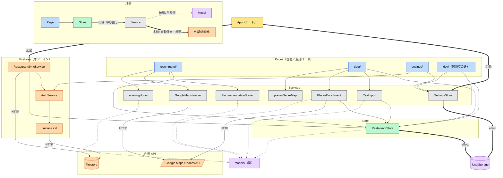
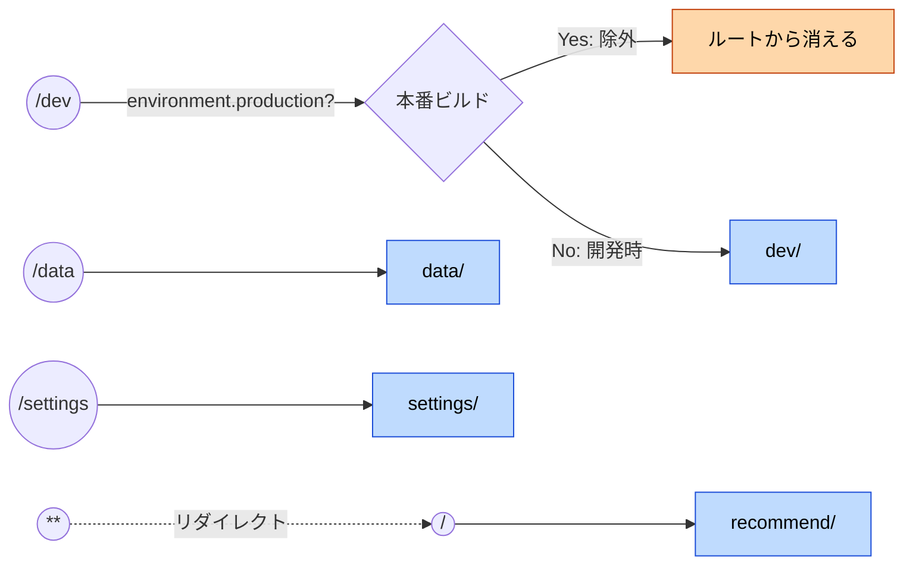
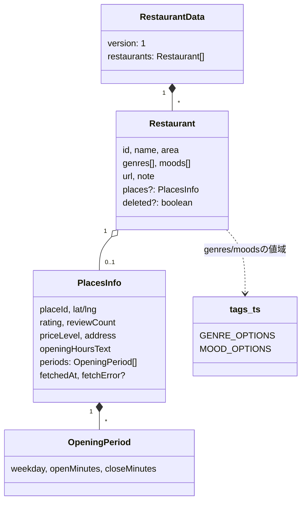
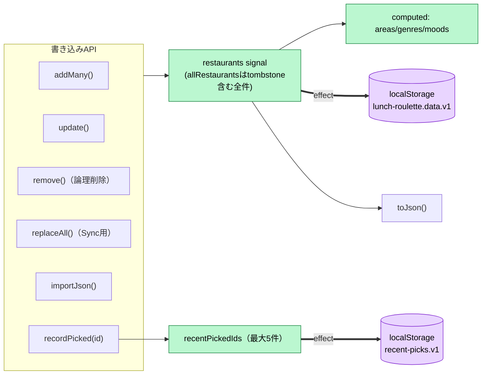
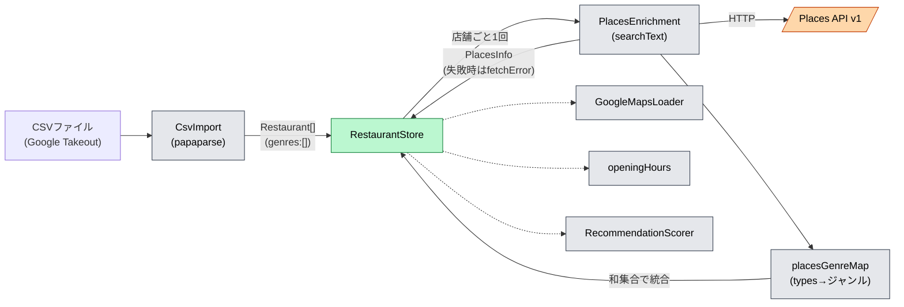
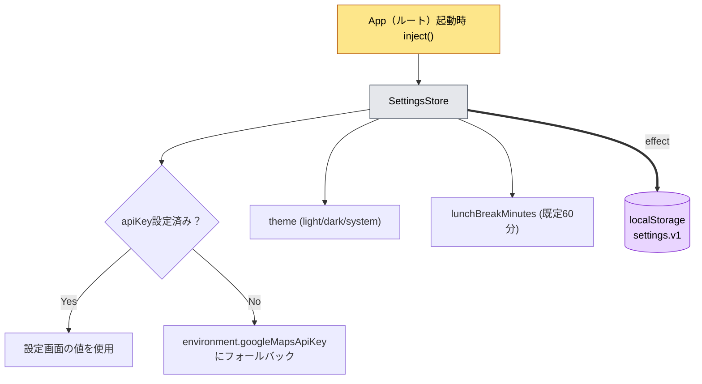
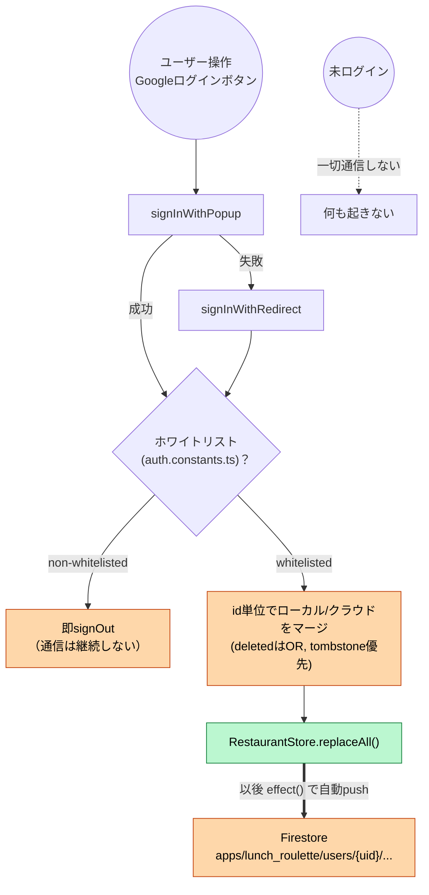
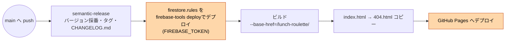
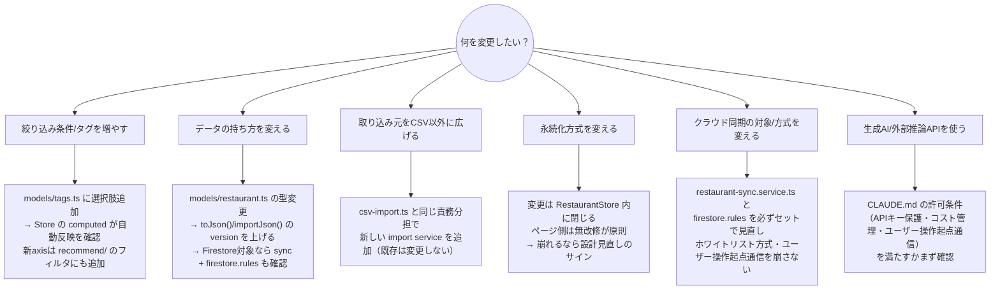

# ARCHITECTURE.md

ランチくじ（Lunch Roulette）の技術アーキテクチャ方針をまとめたドキュメント。
概要や使い方は [docs/overview.md](docs/overview.md)・[docs/user-manual.md](docs/user-manual.md) を参照。

## 1. 概要

Google マップの「保存済みリスト」を CSV でエクスポートし、ジャンル・気分タグで
絞り込んで「今日のランチ」を提案するアプリ。

設計方針:
- **生成AIは使わない**。ジャンル付与も含めすべてルールベース／外部APIの構造化データに
  基づく（後述の Google Places API の公式 `types` からのマッピング）。
- **既定はローカル完結**。データは基本的にブラウザの `localStorage` に保存する
  （オフラインファースト）。店舗情報の正確化のため Google Places API（外部通信）を
  ユーザー操作（ボタン押下）をきっかけにのみ利用する。バックグラウンドでの自動通信は行わない。
- **クラウド同期はオプトイン**。ユーザーが明示的に Google ログインした場合のみ、
  ホワイトリスト登録された特定アカウントに限り Firestore へデータを同期する。
  ログインしない限りサーバー通信は発生しない。

## 2. 全体アーキテクチャ図

`RestaurantStore` が唯一のデータ経路（[CLAUDE.md](CLAUDE.md)）。
`Firebase` 層は未ログイン時は一切通信しないオプトイン経路。

## 3. レイヤー構成

### 3.1 ルーティング（`src/app/app.routes.ts`）

すべて `loadComponent` による遅延ロード。

### 3.2 ドメインモデル（`src/app/models/`）

### 3.3 状態管理（`RestaurantStore`）

**状態は必ずこの service 経由**（ページから直接 `localStorage` を触らない）。

### 3.4 CSV取り込み & 店舗情報拡充パイプライン

APIキーは `SettingsStore` 優先、未設定時は `environment.googleMapsApiKey` にフォールバック。
`GenreMap` の呼び出し元は `pages/data/`（`PlacesEnrichment` 内部からではない）。
店名の正規表現推定（旧 `genre-guess.ts`）は廃止済み。

### 3.5 設定・APIキー管理（`SettingsStore`）

### 3.6 認証・クラウド同期（`core/firebase/`, オプトイン）

`RestaurantSyncService`・`firebase.init` はルートの `App` で起動するが、実処理は
ログイン成否の分岐で完全にゲートされる（未ログイン＝通信ゼロ）。

### 3.7 画面（`src/app/pages/`）機能一覧

| ページ | 主要機能 |
|---|---|
| `recommend/` | エリア/ジャンル/気分トグル絞込（軸内OR・軸間AND）、残り営業時間フィルタ、`sortMode`(random/near/rating)、`RecommendationScorer`による「今日のおすすめ」1件選出＋地図表示＋`recordPicked()` |
| `data/` | CSV取り込み、店舗ごとのタグ編集、エリア別グルーピング表示、Places情報の個別/一括取得（200ms間隔で逐次）、JSONエクスポート/インポート |
| `settings/` | Google Maps APIキー入力・保存・マスク表示、テーマ切替、昼休み時間設定、Googleログイン/ログアウト、`APP_VERSION`/`RELEASE_DATE`表示 |
| `dev/`（開発時のみ） | ストア件数（全体/有効/削除済み/エリア別/ジャンル別/気分別）、生JSON、設定・環境情報（APIキーはマスク）、認証状態、直近ピックJSONの表示・コピー |

## 4. 技術スタックと非機能要件

| 技術 | 用途 |
|---|---|
| Angular 22 | standalone / signals / `inject()`、NgModule不使用 |
| Angular Material 22 | UIコンポーネント全般 |
| papaparse | CSVパース |
| `@angular/google-maps` + Maps/Places API v1 | 店舗情報拡充・地図表示 |
| Firebase SDK (Auth + Firestore) | ホワイトリストアカウントのみのオプトイン同期。独自バックエンドなし |
| Service Worker (`ngsw-config.json`) | オフラインファースト・PWA化。既定は`localStorage`のみ |
| Vite ベース `@angular/build` | ビルド。開発サーバーは固定ポート4202 |

## 5. CI/CD・バージョニング

コミット種別→バージョン: `fix:`/`perf:`→PATCH、`feat:`→MINOR、`feat!:`/`BREAKING CHANGE:`→MAJOR、
`docs:`/`chore:`/`refactor:`/`style:`/`test:`/`ci:`→上昇なし。
`src/version.ts` はリリース時のみ `scripts/generate-version.mjs` が生成（`npm start`/`build` では再生成しない）。

## 6. 今後の方針判断のための指針

