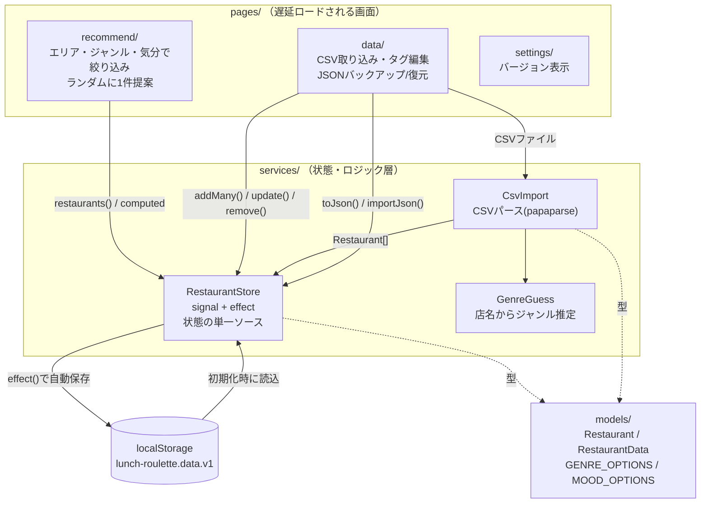

# ARCHITECTURE.md

ランチくじ（Lunch Roulette）の技術アーキテクチャ方針をまとめたドキュメント。
概要や使い方は [docs/overview.md](docs/overview.md)・[docs/user-manual.md](docs/user-manual.md) を参照。

## 1. 概要

Google マップの「保存済みリスト」を CSV でエクスポートし、ジャンル・気分タグで
絞り込んで「今日のランチ」をランダムに提案するアプリ。

設計方針:
- **AI は使わない**。ジャンル推定も含めすべてルールベース（キーワード/店名マッチング）。
- **ローカル完結**。サーバー・バックエンド API を持たず、データは
  ブラウザの `localStorage` にのみ保存する（オフラインファースト）。

## 2. 全体アーキテクチャ図

図の読み方:
- 実線の矢印はメソッド呼び出し・データの受け渡し（同期的な依存関係）。
- 破線は「型として参照している」だけの関係（実行時の依存ではない）。
- `RestaurantStore` が唯一のデータ経路であり、各ページは直接 `localStorage`
  を触らない（[CLAUDE.md](CLAUDE.md) の規約どおり）。

## 3. レイヤー構成

### 3.1 ルーティング（`src/app/app.routes.ts`）
`/`（Recommend）、`/data`（Data）、`/settings`（Settings）の3ルートを
すべて `loadComponent` で遅延ロードする。`**` は `/` へリダイレクト。

### 3.2 ドメインモデル（`src/app/models/`）
- `restaurant.ts` — `Restaurant`（id/name/area/genres/moods/url/note）と
  JSON入出力用の `RestaurantData`（`version: 1` + `restaurants[]`）。
- `tags.ts` — `GENRE_OPTIONS` / `MOOD_OPTIONS` の選択肢定義。UI と
  自動タグ推定の両方から参照される単一のソース。

### 3.3 状態管理（`src/app/services/restaurant-store.ts`）
- `restaurants` を signal として保持し、`areas` / `genres` / `moods` を
  `computed` として派生（フィルタ UI 用の一覧）。
- `addMany()`（重複排除しつつ追加）、`update()`、`remove()`、`clear()`、
  `toJson()` / `importJson()`（バックアップ用）を提供。
- `effect()` が `restaurants()` の変化を監視し、`localStorage`
  （キー: `lunch-roulette.data.v1`）へ自動保存する。
- **状態は必ずこの service 経由で操作する**という規約は、永続化ロジックを
  1箇所に集約し、コンポーネント側でストレージ形式を意識させないため。

### 3.4 CSV 取り込みパイプライン
- `services/csv-import.ts` — `papaparse` で CSV をパースし、列名の揺れ
  （title/name, note/comment, url/link）を吸収して `Restaurant[]` に変換。
  ファイル名からエリア名を決定する。
- `services/genre-guess.ts` — 店名をチェーン店辞書・キーワード正規表現と
  照合し、初期ジャンルを推定する（AI 不使用、あくまで初期値でユーザーが
  後から編集可能）。

### 3.5 画面（`src/app/pages/`）
- `recommend/` — トップページ。エリア/ジャンル/気分をトグルで絞り込み
  （軸内は OR、軸間は AND）、「ランダムに選ぶ」で1件提示。
- `data/` — CSV 取り込み、店舗ごとのタグ編集、エリア別グルーピング表示、
  JSON エクスポート/インポートによるバックアップ。
- `settings/` — ビルド時生成の `APP_VERSION` / `RELEASE_DATE` を表示するのみ。

## 4. 技術スタックと非機能要件

- Angular 22（standalone components / signals / `inject()`、NgModule 不使用）
- Angular Material 22（UI コンポーネント全般）
- `papaparse`（CSV パース）
- オフラインファースト: バックエンド API なし、Service Worker
  （`ngsw-config.json`）で PWA 化、データは `localStorage` のみ。
- ビルド: Vite ベースの `@angular/build`、開発サーバーは固定ポート 4202
  （`angular.json` の `architect.serve.options.port`）。

## 5. CI/CD・バージョニング

- Conventional Commits + semantic-release（設定: `.releaserc.json`）で
  バージョンを自動採番。`fix:`/`perf:` → PATCH、`feat:` → MINOR、
  `feat!:`/`BREAKING CHANGE:` → MAJOR。`docs:`/`chore:`/`refactor:`/`style:`/
  `test:`/`ci:` はバージョン上昇なし。
- `src/version.ts`（`APP_VERSION`/`RELEASE_DATE`）はリリース時のみ
  `scripts/generate-version.mjs` が生成する（`npm start`/`build` では再生成しない）。
- `.github/workflows/deploy.yml` — main への push で
  semantic-release → ビルド（`--base-href=/lunch-roulette/`）→
  `index.html` を `404.html` にコピー → GitHub Pages へデプロイ。

## 6. 今後の方針判断のための指針

新機能を追加する際は、まず以下の観点でどのレイヤーに置くべきか判断する。

- **絞り込み条件やタグの種類を増やす** → `models/tags.ts` に選択肢を足し、
  `RestaurantStore` の `computed` が自動的に反映する設計になっているかを確認。
  新しい axis（軸）を足す場合は `recommend/` のフィルタロジックにも軸を追加する。
- **データの持ち方を変える**（例: 新しいフィールド追加）→
  `models/restaurant.ts` の型を変更し、`RestaurantStore.toJson()`/
  `importJson()` のバージョン番号（`version`）を上げてマイグレーションを検討する。
- **取り込み元を CSV 以外に広げる**（例: 別のエクスポート形式）→
  `services/csv-import.ts` と同じ責務分担（パース→ジャンル推定→
  `RestaurantStore.addMany()`）を踏襲した新しい import service を追加し、
  既存サービスを変更しない。
- **永続化方式を localStorage から変える**（IndexedDB やクラウド同期など）→
  変更は `RestaurantStore` 内に閉じるはずであり、ページ側のコードは
  一切変更不要であるべき。もし変更が必要になった場合は「状態は必ず
  `RestaurantStore` 経由」という規約が崩れている兆候なので設計を見直す。
- **AI を使う機能を追加する検討をする場合** → 「AI は使わない」という
  現在の設計方針からの逸脱になるため、まずこのドキュメントとユーザーへの
  影響範囲（ローカル完結・オフライン動作が失われる可能性）を確認してから
  判断する。
