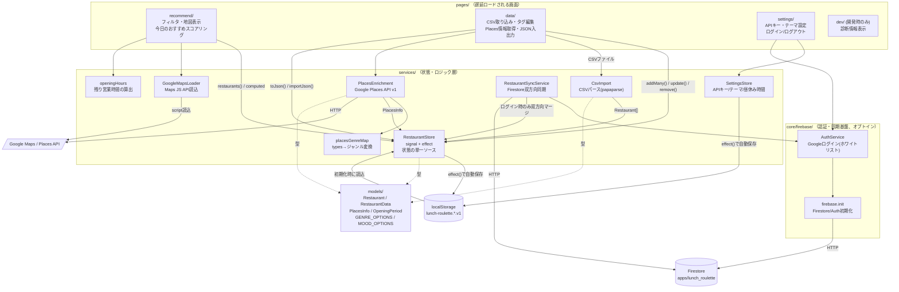

# ARCHITECTURE.md

ランチくじ（Lunch Roulette）の技術アーキテクチャ方針をまとめたドキュメント。
概要や使い方は [docs/overview.md](docs/overview.md)・[docs/user-manual.md](docs/user-manual.md) を参照。

## 1. 概要

Google マップの「保存済みリスト」を CSV でエクスポートし、ジャンル・気分タグで
絞り込んで「今日のランチ」を提案するアプリ。

設計方針:
- **生成AIは使わない**。ジャンル付与も含めすべてルールベース／外部APIの構造化データに
  基づく（後述の Google Places API の公式 `types` からのマッピング）。
- **既定はローカル完結**。データは基本的にブラウザの `localStorage` に保存する
  （オフラインファースト）。店舗情報の正確化のため Google Places API（外部通信）を
  ユーザー操作（ボタン押下）をきっかけにのみ利用する。バックグラウンドでの自動通信は行わない。
- **クラウド同期はオプトイン**。ユーザーが明示的に Google ログインした場合のみ、
  ホワイトリスト登録された特定アカウントに限り Firestore へデータを同期する。
  ログインしない限りサーバー通信は発生しない。

## 2. 全体アーキテクチャ図

図の読み方:
- 実線の矢印はメソッド呼び出し・データの受け渡し（同期的な依存関係）。
- 破線は「型として参照している」だけの関係（実行時の依存ではない）。
- `RestaurantStore` が唯一のデータ経路であり、各ページは直接 `localStorage`
  を触らない（[CLAUDE.md](CLAUDE.md) の規約どおり）。
- `core/firebase/` 配下（認証・Firestore同期）は、ユーザーが明示的にログインしない限り
  一切の通信を行わないオプトイン経路。

## 3. レイヤー構成

### 3.1 ルーティング（`src/app/app.routes.ts`）
`/`（Recommend）、`/data`（Data）、`/settings`（Settings）の3ルートに加え、
`/dev`（Dev、開発時診断ページ）を持つ。`dev` ルートは `environment.production`
を見て本番ビルドの `routes` 配列から除外される。すべて `loadComponent` で遅延ロードし、
`**` は `/` へリダイレクト。

### 3.2 ドメインモデル（`src/app/models/`）
- `restaurant.ts` — `Restaurant`（id/name/area/genres/moods/url/note に加え、
  Places 情報のキャッシュ `places?: PlacesInfo` と論理削除用の `deleted?` フラグを持つ）と
  JSON入出力用の `RestaurantData`（`version: 1` + `restaurants[]`）。
- `places.ts` — Google Places API から取得する `PlacesInfo`（placeId・座標・
  評価・レビュー件数・価格帯・住所・営業時間テキスト・週単位に正規化した
  `OpeningPeriod[]`・取得日時・取得エラー）と `OpeningPeriod` の型定義。
- `tags.ts` — `GENRE_OPTIONS` / `MOOD_OPTIONS` の選択肢定義。UI・
  `places-genre-map.ts` の両方から参照される単一のソース。

### 3.3 状態管理（`src/app/services/restaurant-store.ts`）
- `restaurants`（論理削除済みを除く）と `allRestaurants`（tombstoneを含む全件）を
  signal として保持し、`areas` / `genres` / `moods` を `computed` として派生
  （フィルタ UI 用の一覧）。
- `addMany()`（重複排除しつつ追加）、`update()`、`remove()`（論理削除）、`clear()`、
  `replaceAll()`（Firestore同期のマージ結果を丸ごと反映する用途）、
  `toJson()` / `importJson()`（バックアップ用）を提供。
- 「今日のおすすめ」の直近ピック回避のため、`recentPickedIds`（最大5件、
  `lunch-roulette.recent-picks.v1` に別途永続化）と `recordPicked(id)` を提供する。
- `effect()` が `restaurants()` の変化を監視し、`localStorage`
  （キー: `lunch-roulette.data.v1`）へ自動保存する。
- **状態は必ずこの service 経由で操作する**という規約は、永続化ロジックを
  1箇所に集約し、コンポーネント側でストレージ形式を意識させないため。

### 3.4 CSV取り込み & 店舗情報拡充パイプライン
- `services/csv-import.ts` — `papaparse` で CSV をパースし、列名の揺れ
  （title/name, note/comment, url/link）を吸収して `Restaurant[]` に変換。
  ファイル名からエリア名を決定する。ジャンルは取り込み時点では未設定（空配列）。
- `services/places-enrichment.ts` — Google Places API v1（`searchText`）を
  店舗ごとに1回のみ呼び出し、座標・評価・レビュー件数・営業時間等を取得して
  `PlacesInfo` として `Restaurant.places` にキャッシュする。エラー時は例外を
  投げず `fetchError` に格納する。API キーは `SettingsStore` の値を優先し、
  未設定時は `environment.googleMapsApiKey` にフォールバックする。
- `services/places-genre-map.ts` — Places の公式ジャンル（`types`）を
  `tags.ts` の日本語ジャンルタグへ変換する静的マッピング（`mapPlaceTypesToGenres`）。
  `pages/data/` で取得成功時に既存の手動タグと統合（和集合）して反映する。
  店名からの正規表現推定（旧 `genre-guess.ts`）は廃止済みで、このマッピングに
  完全に置き換わっている。
- `services/google-maps-loader.ts` — Google Maps JavaScript API スクリプトの
  動的読み込み（一度だけロードし Promise をメモ化）。`recommend/` の地図表示で使用。
- `services/opening-hours.ts` — `getRemainingOpenMinutes()`。`OpeningPeriod[]`
  と現在時刻から、日またぎの営業時間にも対応した「残り営業時間（分）」を算出する
  純粋関数。`recommend/` の「余裕時間」フィルタで使用。

### 3.5 設定・APIキー管理（`src/app/services/settings-store.ts`）
- `googleMapsApiKey`（ユーザーが設定画面で入力した値。`environment.ts` の値より優先）、
  `theme`（light/dark/system）、`lunchBreakMinutes`（既定60分）を保持する signal ストア。
  `localStorage`（キー: `lunch-roulette.settings.v1`）へ自動保存。

### 3.6 認証・クラウド同期（`src/app/core/firebase/`, オプトイン）
- `core/firebase/firebase.init.ts` — Firebase App/Auth/Firestore を初期化
  （IndexedDBによる永続キャッシュ、マルチタブ対応）。
- `core/firebase/auth.service.ts` — `AuthService`。Google ポップアップログイン
  （失敗時リダイレクトへフォールバック）。`auth.constants.ts` のメールアドレス
  ホワイトリストでログイン可否を判定し、`user` / `ready` / `loginError` を signal で公開。
- `services/restaurant-sync.service.ts` — `RestaurantSyncService`。
  `AuthService.user()` がセットされている（＝ログイン済み）場合のみ動作する
  Firestore 双方向同期。ログイン時にローカルとクラウドを id 単位でマージ
  （`deleted` フラグは OR、tombstone優先）し `RestaurantStore.replaceAll()` へ反映、
  以後はログイン中に限り `restaurants()` の変更を `effect()` で自動的に
  Firestore（`apps/lunch_roulette/users/{uid}/restaurants/{id}`）へ push する。
  未ログイン時はこの経路は一切通信しない。

### 3.7 画面（`src/app/pages/`）
- `recommend/` — トップページ。エリア/ジャンル/気分をトグルで絞り込み
  （軸内は OR、軸間は AND）に加え、`opening-hours.ts` を使った「残り営業時間」
  フィルタを持つ。`sortMode`（random/near/rating）で一覧を並び替え可能
  （near は現在地からの距離、rating は評価順）。「今日のおすすめ」は、
  ベイズ平均評価（フィルタ後リストの平均へレビュー数10件相当分だけ縮約）から
  距離ペナルティと直近ピック（`recentPickedIds`）減点を差し引いたスコアで
  最上位の1件を選び、`GoogleMapsLoader` 経由の地図に表示し `recordPicked()` で記録する。
- `data/` — CSV 取り込み、店舗ごとのタグ編集、エリア別グルーピング表示、
  Places 情報の個別／一括取得（レート制限のため200ms間隔で逐次実行し、
  自動検出ジャンルを手動タグと統合）、JSON エクスポート/インポートによるバックアップ。
- `settings/` — Google Maps API キーの入力・保存・マスク表示、テーマ切替、
  昼休み時間の設定、Google ログイン/ログアウト（同期状態・エラー表示）、
  ビルド時生成の `APP_VERSION` / `RELEASE_DATE` の表示。
- `dev/`（開発時のみ、本番ルートから除外）— ストアの件数（全体/有効/削除済み/
  エリア別/ジャンル別/気分別）、生の `Restaurant` JSON、設定・環境情報
  （API キーはマスク表示、Firebase プロジェクトID）、認証状態、直近ピックの
  生JSONなど診断情報の表示とクリップボードコピー。

## 4. 技術スタックと非機能要件

- Angular 22（standalone components / signals / `inject()`、NgModule 不使用）
- Angular Material 22（UI コンポーネント全般）
- `papaparse`（CSV パース）
- `@angular/google-maps` ＋ Google Maps JavaScript API / Places API v1（店舗情報拡充・地図表示）
- Firebase SDK（Auth + Firestore）— ホワイトリスト登録済みアカウントがログインした
  場合のみ使用するオプトイン機能。独自バックエンドは持たない。
- オフラインファースト: 既定はデータを `localStorage` のみに保持し、Service Worker
  （`ngsw-config.json`）で PWA 化。
- ビルド: Vite ベースの `@angular/build`、開発サーバーは固定ポート 4202
  （`angular.json` の `architect.serve.options.port`）。

## 5. CI/CD・バージョニング

- Conventional Commits + semantic-release（設定: `.releaserc.json`）で
  バージョンを自動採番。`fix:`/`perf:` → PATCH、`feat:` → MINOR、
  `feat!:`/`BREAKING CHANGE:` → MAJOR。`docs:`/`chore:`/`refactor:`/`style:`/
  `test:`/`ci:` はバージョン上昇なし。
- `src/version.ts`（`APP_VERSION`/`RELEASE_DATE`）はリリース時のみ
  `scripts/generate-version.mjs` が生成する（`npm start`/`build` では再生成しない）。
- `.github/workflows/deploy.yml` — main への push で以下を順に実行:
  1. semantic-release によるバージョン採番・タグ・`CHANGELOG.md` 生成。
  2. リポジトリ管理下の `firestore.rules`（Firestoreのセキュリティルール本体。
     ホワイトリスト対象アカウントのみ自分の `apps/lunch_roulette/users/{uid}/...`
     を読み書き可能とする）を `firebase-tools deploy --only firestore:rules` で
     GitHub Secrets の `FIREBASE_TOKEN`（`firebase login:ci` で発行）を使って自動デプロイ。
  3. ビルド（`--base-href=/lunch-roulette/`）→ `index.html` を `404.html` に
     コピー → GitHub Pages へデプロイ。

## 6. 今後の方針判断のための指針

新機能を追加する際は、まず以下の観点でどのレイヤーに置くべきか判断する。

- **絞り込み条件やタグの種類を増やす** → `models/tags.ts` に選択肢を足し、
  `RestaurantStore` の `computed` が自動的に反映する設計になっているかを確認。
  新しい axis（軸）を足す場合は `recommend/` のフィルタロジックにも軸を追加する。
- **データの持ち方を変える**（例: 新しいフィールド追加）→
  `models/restaurant.ts` の型を変更し、`RestaurantStore.toJson()`/
  `importJson()` のバージョン番号（`version`）を上げてマイグレーションを検討する。
  Firestore 同期対象のフィールドが増える場合は `restaurant-sync.service.ts` の
  マージ・push ロジックと `firestore.rules` の整合も確認する。
- **取り込み元を CSV 以外に広げる**（例: 別のエクスポート形式）→
  `services/csv-import.ts` と同じ責務分担（パース→
  `RestaurantStore.addMany()`、ジャンル付与は `places-enrichment.ts` /
  `places-genre-map.ts` の経路に任せる）を踏襲した新しい import service を追加し、
  既存サービスを変更しない。
- **永続化方式を localStorage から変える**（IndexedDB 等）→
  変更は `RestaurantStore` 内に閉じるはずであり、ページ側のコードは
  一切変更不要であるべき。もし変更が必要になった場合は「状態は必ず
  `RestaurantStore` 経由」という規約が崩れている兆候なので設計を見直す。
- **クラウド同期の対象を広げる／同期方式を変える**（例: 設定値も同期する、
  リアルタイム購読にする等）→ `restaurant-sync.service.ts` と `firestore.rules`
  の両方を必ずセットで見直し、`auth.constants.ts` のホワイトリスト方式
  （許可されたアカウント以外は一切同期しない）を崩さないこと。
  バックグラウンド自動通信を増やす変更（CLAUDE.md の「ユーザー操作起点のみ通信」
  規約からの逸脱）にならないかも確認する。
- **AI（生成AI・外部推論API）を使う機能を追加する検討をする場合** →
  現在は生成AI不使用の設計。追加する場合は CLAUDE.md の許可条件
  （APIキー保護やコスト管理などの安全性を担保できること、バックグラウンドでの
  自動通信を行わずユーザー操作起点のみで通信すること）を満たせるかを最初に確認し、
  このドキュメントとユーザーへの影響範囲を検討したうえで判断する。
